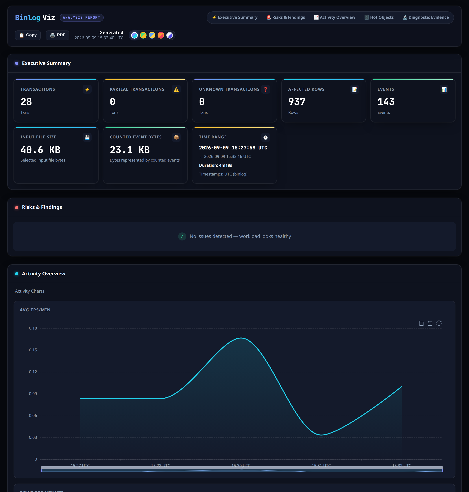
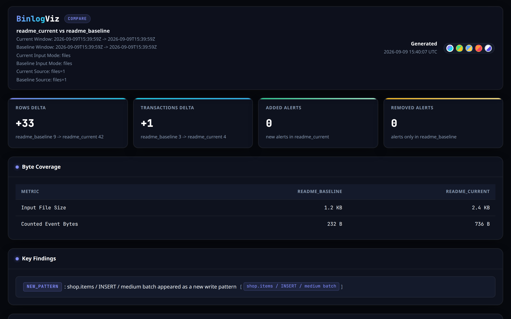

<div align="center">

# BinlogViz

[](https://github.com/Fanduzi/BinlogVisualizer/releases)


[](#license)

[](README.md) [](README_ZH.md)

[](CHANGELOG.md) [](SECURITY.md) [](docs/releases/)
</div>

BinlogViz is a local CLI for MySQL `ROW` binlog analysis. It is built for DBAs and operators who need to quickly answer practical questions from real binlog files: which tables are absorbing the most writes, which transactions are unusually large, where spikes happened, and how workload changed over a time window.

## Screenshots

### Analyze HTML report



### Compare HTML report



## Architecture

The Cobra command layer streams normalized binlog events into the analyzer, then delegates stable machine and human presentation to report, compare, and trend modules.

### Modules

| Module | Responsibility | Documentation |
|--------|----------------|---------------|
| `cmd/binlogviz` | CLI commands and end-to-end orchestration | [README](cmd/binlogviz/README.md) |
| `internal/binlog` | Binlog parsing, probing, and normalization | [README](internal/binlog/README.md) |
| `internal/analyzer` | Streaming aggregation and diagnostics | [README](internal/analyzer/README.md) |
| `internal/model` | Shared analysis and evidence types | [README](internal/model/README.md) |
| `internal/report` | Analyze text, JSON, Markdown, and HTML renderers | [README](internal/report/README.md) |
| `internal/i18n` | Embedded English and Simplified Chinese presentation messages | [README](internal/i18n/README.md) |
| `internal/compare` | Two-report comparison and rendering | [README](internal/compare/README.md) |
| `internal/trend` | Ordered multi-snapshot trend analysis and rendering | [README](internal/trend/README.md) |
| `internal/snapshot` | Named analyze snapshot persistence | [README](internal/snapshot/README.md) |
| `internal/workflow` | Multi-step investigation plans and manifests | [README](internal/workflow/README.md) |

## Start Here

BinlogViz is a **fast ROW-binlog summary**: hot tables, write shapes, and before/after compare. A 510 MB file is typically a few seconds.

It is **not** a full STATEMENT/MIXED analyzer — those files come back empty or undercounted (only ROW images are counted). Printed positions are file evidence; use them as `mysqlbinlog --start-position` only when the reported span covers the transaction events, not an XID-only interval.

### Verify install with the sample ROW binlog

```bash
curl -fsSLO https://raw.githubusercontent.com/Fanduzi/BinlogVisualizer/main/cmd/binlogviz/testdata/minimal.binlog
binlogviz analyze minimal.binlog
```

The same 1500-byte fixture lives at `cmd/binlogviz/testdata/minimal.binlog` in the repo. Each GitHub Release tar.gz also includes that file as `testdata/minimal.binlog`, a discovery-layout copy at `testdata/sample-binlog/mysql-bin.000001`, and an `incident.yaml` whose `from_dir` points at that directory. After extract, `./binlogviz analyze testdata/minimal.binlog` and `./binlogviz workflow run incident.yaml` do not need a clone.

### Inspect one of your own files

```bash
binlogviz analyze mysql-bin.000123
cat mysql-bin.000123 | binlogviz analyze -
```

`analyze -` reads one binary binlog from a pipe. The parser needs a seekable file, so stdin is copied to a temporary file and removed when the command finishes, including SIGHUP (exit 129), Ctrl-C (exit 130), SIGQUIT (exit 131), and SIGTERM (exit 143). A terminal fails before parsing. `/dev/null` and an empty pipe say `stdin has no data`. Replay hints for that input say it came from stdin and do not point at a file. `mysqlbinlog` text output is not a binlog.

The default text report includes Top Threads, ranked by rows (or by events, bytes, or transactions when there are no row images). It shows `thread_id`, and `server_id`, `user@host`, and schema when the binlog stored them, so "who wrote the most" does not need `jq`. `--top` limits that section; `--top-threads 0` keeps every session. JSON exposes the same ranking as `threads`.

The same report includes Hot Rows: the primary keys touched by the most UPDATE and DELETE row images. Each line has the touch count, how many transactions touched that key, the first and last event time, and the GTID plus file:byte of the first and last transaction, so you can open that group in `mysqlbinlog` or BinlogServer. The key comes only from MySQL 8 `binlog_row_metadata=FULL`. If the binlog does not name the key, the report says hot-row tracking is unavailable for that table and does not guess from column `@1`. Tables with no primary key are not ranked here. `--top` limits the section; `--top-rows` overrides it (`0` keeps every tracked key). `--sql-context off` hides the key values and keeps the counts. JSON uses `hot_rows`. Tracking keeps at most 8192 primary keys. A new key after that replaces the least-touched key; the report says the cap was hit, and a row that inherited a dropped key's count is marked approximate. A key that stayed in the table keeps an exact count.

`analyze` exits **0** when at least one event was counted, **1** when the file could not be analyzed (corrupt, truncated, or no Format Description), and **2** when a complete binlog parsed but counted zero events (empty `--start`/`--end` window, or Format Description / rotate only). A schema or table filter that matches nothing is also exit 2, and its `Error:` line says the filter matched no events. `--dml` that matches nothing is the same exit, with `Error: dml filter matched no events`. A filter that matches a view, event, function, procedure, or trigger exits 0 and prints that DDL even when no rows changed. Exit 2 writes nothing to `stdout` and one `Error:` line to `stderr`. If a progress bar is still on the current stderr line, that line is cleared before `Error:`.

### Analyze a whole directory in binlog order

```bash
binlogviz analyze --from-dir /var/lib/mysql --prefix mysql-bin.
```

### Narrow to an incident window

```bash
binlogviz analyze --from-dir /var/lib/mysql --prefix mysql-bin. \
  --start "2026-03-15T10:00:00Z" \
  --end "2026-03-15T10:30:00Z"
```

`--start`/`--end` also accept `YYYY-MM-DD HH:MM:SS` in the local timezone of the machine running `binlogviz`. Prefer RFC3339 with an explicit offset across machines.

### Start from `SHOW MASTER STATUS` position or GTID

Positions are exact event boundaries on one explicit file and use a half-open `[start, stop)` range. Time flags may be supplied too; the predicates intersect.

```bash
binlogviz analyze mysql-bin.000015 --start-position 1651 --stop-position 4096
binlogviz analyze mysql-bin.000015 --include-gtids '24bc7850-2c16-11e6-a073-0242ac110002:7-12'
binlogviz analyze mariadb-bin.000015 --include-gtids '0-7-1857,0-7-1859' --exclude-gtids '0-7-1859'
```

### Focus on one schema or table

```bash
binlogviz analyze --from-dir /var/lib/mysql --prefix mysql-bin. \
  --include-schema orders \
  --include-table payments
```

`--include-table` / `--exclude-table` accept `TABLE` or `SCHEMA.TABLE`, and the same form for a view, event, function, procedure, or trigger. `CREATE TRIGGER` and `DROP TRIGGER` are both named by the trigger, so pass that name.

### Find the bad DELETE and see its rows

```bash
binlogviz analyze mysql-bin.000123 \
  --include-table shop.orders \
  --dml delete \
  --start "2026-10-06 14:00:00" \
  --end "2026-10-06 14:10:00" \
  --show-rows
```

`--dml` takes `insert`, `update`, and `delete`, combined with commas. It applies together with `--include-table` / `--exclude-table`, `--include-schema`, `--start` / `--end`, positions, and GTID filters. Summary, Top Tables, Top Transactions, Top Threads, and alerts count only the kinds you kept, and the report names the filter. A kind filter that matches nothing exits 2 with `Error: dml filter matched no events`.

`--show-rows` is off unless you pass it. For each listed transaction it prints the DELETE before-image, the UPDATE columns that changed (`before -> after`), and the INSERT after-image. MySQL 8 with `binlog_row_metadata=FULL` shows column names. Otherwise the columns are `@1`..`@N`, and the report says names are missing. Values are bounded (32 rows per transaction; strings and blobs stop at 64 bytes; integers, decimals, and `BIT` are printed in full) and a cut is marked, including how many rows were left out. `--sql-context off` omits these values and says so. The transaction's `mysqlbinlog_cmd` is still there for a cross-check. The report itself does not print undo SQL; `binlogviz flashback` does, with the same selectors. A `TIMESTAMP` column is the UTC wall clock of the stored instant, including fractional seconds, and does not follow this machine's timezone. A `DATETIME` column stays the wall clock written in the binlog.

### Find an accidental DROP

```bash
binlogviz analyze mysql-bin.000123
```

The DDL Timeline lists `DROP TABLE`, `TRUNCATE`, and `ALTER` with the GTID of that transaction and the file byte where the transaction starts. Copy `BinlogServer stop_gtid=<gtid>` or `mysqlbinlog --stop-position=<N> <file>`. That stop replays earlier events and excludes the DDL. No GTID in the binlog prints `GTID unavailable` and still prints the position. The timeline does not generate undo SQL. `binlogviz flashback` also refuses a selected range that contains DDL.

### Undo the bad rows

Find the transaction with `analyze`, the DDL Timeline, or `--show-rows`. Then print SQL that reverses only those row changes. Review the script. Apply it yourself. Flashback does not connect to a database.

```bash
binlogviz analyze mysql-bin.000123 \
  --include-table shop.orders \
  --dml delete \
  --show-rows

binlogviz flashback mysql-bin.000123 \
  --include-table shop.orders \
  --dml delete \
  > flashback.sql

mysql --default-character-set=utf8mb4 < flashback.sql
```

`--dml`, `--include-table`, `--include-schema`, `--start` / `--end`, `--start-position` / `--stop-position`, and `--include-gtids` / `--exclude-gtids` are the same selectors as `analyze`. `--schema-file` is not a filter: it supplies table definitions and flashback stays offline. A DELETE becomes an `INSERT` of the before-image. An INSERT becomes a `DELETE`. An UPDATE sets the row back to the before-image and matches the primary key from the after-image, so a changed key still finds the current row. Statements are in reverse binlog order, last transaction first and last row first inside it. Each original transaction is one `START TRANSACTION` / `COMMIT`. A comment names the original GTID (`GTID unavailable` when the binlog has none) and `file:start-position`, the basename and the byte where that transaction starts, so you can cross-check with `mysqlbinlog`.

The binlog must have been recorded with `binlog_row_metadata=FULL` and `binlog_row_image=FULL`. The script sets `utf8mb4`, `time_zone='+00:00'` (`TIMESTAMP` literals are the UTC wall clock), and removes `NO_BACKSLASH_ESCAPES` for that session. A table with no primary key is undone by matching every column and `LIMIT 1`, and the statement says so in a comment. `INSERT` of a deleted row does not use `LIMIT 1`. JSON is rebuilt from the binary document, including JSON inside a transaction recorded with `binlog_transaction_compression=ON`. A non-`utf8mb4` string is a charset introducer and hex bytes. `ENUM` is the member index and `SET` is the bitmask, so a `latin1` or `gbk` value is exact under strict and non-strict `sql_mode`. Generated columns named by `CREATE` or `ALTER` in the parsed files, or by `--schema-file` (`mysqldump --no-data`, or `SHOW CREATE TABLE`), are left out of `INSERT` and `UPDATE` assignments only when that definition matches the binlog. MySQL 8 row metadata does not mark generated columns, and a `FULL` image includes both virtual and stored values, so those logged values are checked against the expression. The schema file must describe the table as it was at incident time. Flashback checks column count, names, order, and the types the binlog records, and prints no SQL when they differ. A generated column is omitted when every logged value matches the expression. The check covers integer and `DECIMAL` `+`, `-`, `*`, `/`, `DIV`, `%`, `MOD`, plus `UPPER`, `LOWER`, `CONCAT`, `CONCAT_WS`, `LENGTH`, `CHAR_LENGTH`, and simple JSON extraction. `/` into an integer is rounded half away from zero, so `5 / 2` is `3` and `-5 / 2` is `-3`. `/` into `DECIMAL(p,s)` keeps MySQL's default division width (9 fractional digits for integer operands) and then rounds half away from zero to scale `s`, so `5 / 2` in `DECIMAL(40,4)` is `2.5000` and `1 / 7` in `DECIMAL(40,9)` is `0.142857142`. A logged value that contradicts the expression exits 1 and prints no SQL, including a quotient written with `div_precision_increment = 0`. A result that does not fit the column, when the logged value is the non-strict clip, is omitted with a warning. An expression that cannot be checked is omitted, stderr warns, and a guard after the session `SET` lines fails apply unless that column is generated on the target. A client that continues is switched to a read-only session, so later writes fail. When the logged values equal a checked expression, a real column still cannot be told apart from a generated one until that guard runs. A no-primary-key `WHERE` keeps generated columns. A plain `mysqldump --no-data db` file needs no `USE`: the database is the dump's `Database:` header, `--schema-file-db`, or the only schema of that table in the binlog. Several `SHOW CREATE TABLE` results can share a file with no `;` between them. An ambiguous database is a warning, and that definition is not used. An `ENUM` index of 0, the error member from a non-strict insert, is written as `0`. The script saves `@@SESSION.sql_mode`, drops `STRICT_TRANS_TABLES`, `STRICT_ALL_TABLES`, and `TRADITIONAL` for that statement only, and restores the saved mode. `TRADITIONAL` is removed because MySQL expands it back into the strict modes. When a selected table has no definition, the script still lists every column and stderr warns that generated columns cannot be ruled out and that apply can stop at `ERROR 3105` with earlier transactions already committed.

`ON DELETE` / `ON UPDATE CASCADE` child rows are not restored. Triggers fire on undo. Later changes to the same primary key are overwritten, with no conflict check. A table filter or `--dml` that undoes only part of a transaction prints a warning on stderr. Review the script and test it. Apply it in a single session on the primary with `sql_log_bin=1`. A statement that fails leaves earlier transactions in the script committed. Known limits are in [docs/concept/limitations.md](docs/concept/limitations.md): a schema file that marks a real column as generated can still omit that column and exit 0 when the logged values equal a checked expression ([#166](https://github.com/Fanduzi/BinlogVisualizer/issues/166)). A contradiction is refused. A wrong dump that still exits 0 is stopped by the apply guard before any transaction. A client that continues after the error is switched to a read-only session, so later writes fail; disconnect, fix the schema file, and apply again in a new session. If the live column was altered to generated after the incident, the original value cannot be written back. Rows written under a non-strict `sql_mode` (a zero date, or a generated `a/b` with `b` = 0) restore under a strict session: only that statement drops the flag that would reject the stored value ([#180](https://github.com/Fanduzi/BinlogVisualizer/issues/180)). Omitting `--schema-file` still assigns a real generated column and apply can stop at `ERROR 3105`. An `ALTER` the parsed binlog applies again, a joined dump that keeps only the first `Database:` header (a per-database run needs that database's own dump), and an ambiguous table name ([#167](https://github.com/Fanduzi/BinlogVisualizer/issues/167)). `ENUM` index 0 drops `TRADITIONAL` with the strict modes for that statement and then restores the saved `sql_mode`, including `sql_mode=TRADITIONAL` ([#168](https://github.com/Fanduzi/BinlogVisualizer/issues/168)). Re-running a script after a failed statement can duplicate rows in a table with no primary key. Resume from the failed `-- gtid:` block and keep the script's `SET NAMES`, `SET time_zone`, and `SET SESSION sql_mode` header; without it, `TIMESTAMP` values shift by the session time zone and apply still exits 0. The steps are in that document.

Flashback exits 1, writes one `Error:` line, and prints no SQL when column names are missing, a before- or after-image is incomplete, a column type cannot be rendered exactly (`FLOAT`, `DOUBLE`, `GEOMETRY`, `VECTOR`, a partial or inexact JSON value, an unknown charset, or missing signedness, collation, or ENUM/SET members), a table definition was seen and cannot be read, `--schema-file` does not match the binlog columns, a generated value contradicts the expression, or the selected range contains DDL. `--sql-context off` is the same refusal: the script is the row values. Nothing selected is exit 2 with the same `Error:` line `analyze` uses (`schema/table filter matched no events`, `dml filter matched no events`, or `window matched 0 events`) and empty stdout. Auth-DDL `<secret>` redaction still applies to statement text in `analyze`. Flashback does not print those statements; an auth DDL in the selected range is refused as DDL. Cell values are not redacted. `analyze` text, Markdown, JSON, and HTML are unchanged when you do not run `flashback`.

### Send machine-readable output to another tool

```bash
binlogviz analyze --from-dir /var/lib/mysql --prefix mysql-bin. --format json > analyze.json
```

### Save two incident windows as named snapshots, then compare them

```bash
binlogviz analyze --from-dir /var/lib/mysql --prefix mysql-bin. \
  --start "2026-03-15T10:00:00Z" \
  --end "2026-03-15T10:30:00Z" \
  --workload-id orders-production \
  --format json \
  --snapshot-name incident_current

binlogviz analyze --from-dir /var/lib/mysql --prefix mysql-bin. \
  --start "2026-03-08T10:00:00Z" \
  --end "2026-03-08T10:30:00Z" \
  --workload-id orders-production \
  --format json \
  --snapshot-name incident_baseline

binlogviz snapshot list
binlogviz snapshot list --format json
binlogviz snapshot show incident_current
binlogviz snapshot show incident_current --format json
binlogviz snapshot rename incident_current incident_current_renamed
binlogviz snapshot delete incident_current_renamed
binlogviz compare \
  --current-snapshot incident_current \
  --baseline-snapshot incident_baseline \
  --format html > compare.html
```

When `--snapshot-name` is set, `analyze --format json` still writes the JSON report to `stdout` and also saves the same payload under `~/.binlogviz/snapshots/<name>.json`. The save confirmation is printed to `stderr`.

`snapshot list` now prints a human-readable table with `name`, `label`, `created_at`, `input_mode`, and `window`. `snapshot list --format json` and `snapshot show --format json` still provide stable machine-readable output for scripts and external tooling. `snapshot rename` keeps the stored snapshot identity in sync with the renamed file, and `snapshot delete` removes one saved snapshot without touching the rest of the store.

`compare` can load either two saved snapshots or two JSON files generated by `binlogviz analyze --format json`. It renders `text`, `json`, or `html` output. Raw numeric deltas are always available, while causal findings, recommendations, and drilldowns require an explicit matching non-empty `--workload-id` plus compatible report-v3 provenance, scope, and complete transaction evidence. Server IDs, versions, schemas, filenames, and producer flavor remain visible evidence but never prove workload identity. Missing identity or legacy v0-v2 metadata produces an `unknown` comparability guard; conflicting identity, producer flavor, or scope produces `not_comparable`. The text and HTML variants show that guard first and suppress ordinary causal narrative.

The compare report is written to `stdout`. If the compare command fails, the CLI reports the error through `stderr`.

### Review multiple snapshots as one ordered trend

```bash
binlogviz trend incident_week1 incident_week2 incident_week3 --format text

binlogviz trend --from-snapshots 'incident_week*' \
  --baseline-snapshot baseline_weekly \
  --format html > trend.html
```

`trend` loads saved snapshots, orders them by effective window start time, and renders `text`, `json`, or `html` output. It applies the same comparability verdict across the optional baseline and every trend point: one `unknown` or `not_comparable` input suppresses causal findings, recommendations, and drilldowns for the series while preserving raw points and movements. New snapshots use `snapshot.window.start_time`; older snapshots can fall back to `summary.start_time` for ordering, but their legacy metadata cannot establish comparability.

### Run a multi-step investigation from one plan file

The repository ships a runnable `incident.yaml` that points at the 1500-byte ROW sample in `cmd/binlogviz/testdata/sample-binlog`. From the repository root, this first command does not need a local `/var/lib/mysql`. Release archives ship a separate `incident.yaml` whose `from_dir` is `testdata/sample-binlog` so the same command works after extract:

```bash
binlogviz workflow run incident.yaml
tree artifacts/incident
```

The same plan and fixture are also available as raw URLs:

- plan: https://raw.githubusercontent.com/Fanduzi/BinlogVisualizer/main/incident.yaml
- sample binlog: https://raw.githubusercontent.com/Fanduzi/BinlogVisualizer/main/cmd/binlogviz/testdata/sample-binlog/mysql-bin.000001

`workflow run` executes a declarative YAML plan that defines analysis windows, optional compare jobs, and optional trend jobs. It produces a deterministic artifact directory with `analyze/`, `compare/`, `trend/`, a `manifest.json` that records every step's status and output path, and an `index.html` landing page. `manifest.json` always persists a `workflow_summary` object with `findings`, `recommendations`, and `warnings` arrays. BinlogViz rebuilds that summary best-effort from successful compare/trend JSON artifacts only; missing or unreadable summary inputs become warnings and never change workflow or step status semantics. When summary items exist, `index.html` surfaces them as `Workflow Recommendations`, `Workflow Findings`, and `Workflow Summary Warnings`, linking to the preferred HTML source report and falling back to JSON when needed. `stdout` stays empty in v1; all status goes to `stderr`. See [CLI Reference](docs/reference/cli.md) for the plan schema and flags.

If a workflow run fails partway through, `workflow resume` picks up from the existing output directory: it reuses successful steps, reruns failed or missing ones, and supports `--rerun` selectors to force specific steps. After a fully successful run, `workflow resume` exits 0 and prints `nothing to resume` on `stderr`; use `--rerun` to force work. Resume refuses to proceed if the plan file changed or the manifest is from a legacy pre-v2 run. Resume also rejects plan paths that resolve outside the workflow root or escape via symlinks (trust-boundary hardening). `workflow status` reports the same trust check: an untrusted plan still produces full status output but sets `resumable` to `false` with a trust-boundary `resume_error`.

Before execution, `workflow validate` checks whether a plan is statically runnable from `plan.yaml` alone, and `workflow describe` previews the deterministic analyze / compare / trend artifact layout that the plan would produce. Both commands support `--format text` and `--format json`, read only the plan file, and do not inspect `output_dir`, `manifest.json`, or `index.html`. `workflow validate` still exits 0 for a structurally valid plan, but warns when `defaults.input.from_dir` looks like a placeholder or does not exist.

`workflow status` is the read-only runtime inspection command for an existing workflow root. It reads `manifest.json`, checks artifact presence, reports `runtime_state`, `resumable`, and `resume_error`, carries the persisted `workflow_summary` through `--format json`, and includes a dry `resume_preview` when the saved plan can still be loaded. Text output renders `Workflow Recommendations`, `Workflow Findings`, and `Workflow Summary Warnings` only when those persisted arrays are non-empty. It never executes steps, never rebuilds workflow summary, and never rewrites workflow outputs.

`workflow clean` is the final maintenance command in that lifecycle. It uses the current manifest as the source of truth, defaults to dry-run, reports orphaned generated artifacts under `analyze/`, `compare/`, and `trend/`, and can optionally include orphaned snapshot JSON files when `--include-snapshots` is set. `--apply` performs best-effort deletion, while still refusing to touch `manifest.json`, `index.html`, plan files, or unknown out-of-scope files.

`workflow export` is the read-only handoff command for a completed workflow root. It reads `manifest.json`, bundles manifest-declared artifacts into a deterministic zip archive, includes `manifest.json` and best-effort `index.html`, and optionally includes referenced snapshots with `--include-snapshots`. It never reruns steps and rejects archive paths inside the workflow root.

```bash
binlogviz workflow resume ./artifacts/incident
binlogviz workflow resume ./artifacts/incident --rerun analyze:week2
binlogviz workflow status ./artifacts/incident
binlogviz workflow status ./artifacts/incident --format json
binlogviz workflow clean ./artifacts/incident
binlogviz workflow clean ./artifacts/incident --apply --include-snapshots
binlogviz workflow export ./artifacts/incident
binlogviz workflow export ./artifacts/incident --include-snapshots --format json
binlogviz workflow validate incident.yaml
binlogviz workflow validate incident.yaml --format json
binlogviz workflow describe incident.yaml
binlogviz workflow describe incident.yaml --format json
```

### Generate a Markdown or HTML report

```bash
# Markdown — paste into GitHub issues, wikis, or docs
binlogviz analyze mysql-bin.000123 --format markdown > report.md

# HTML — redirected stdout receives the document
binlogviz analyze mysql-bin.000123 --format html > report.html

# HTML — explicit output path
binlogviz analyze mysql-bin.000123 --format html --output report.html

# HTML — force stdout (or omit --output when stdout is already redirected)
binlogviz analyze mysql-bin.000123 --format html --output -
```

The HTML report includes interactive charts (rows/txns per minute, top tables, operation mix), optional pattern drilldowns for high-signal write patterns, and a five-theme switcher.

## Analyze Performance Gate

For incident triage, the target for a 1 GB single-binlog `analyze` run is 10 seconds on the target DBA environment. Runs above 15 seconds should be treated as performance failures and profiled with `pprof`. Hot-row tracking does not keep a map of every row in that file: it keeps at most 8192 primary keys. Past that, a new key replaces the least-touched key and the report marks the inherited count approximate.

Default `--detail-store none` produces JSON equivalent to `--detail-store duckdb` while reducing peak RSS by roughly 38% (measured on a 988 MB MySQL 8.0 ROW binlog). Wall time remains parser/streaming-bound.

Recommended manual check:

```bash
time binlogviz analyze /path/to/mysql-bin.000044 --format text > /tmp/binlogviz-text.txt
time binlogviz analyze /path/to/mysql-bin.000044 --format html --output /tmp/binlogviz.html
```

Text output is intended to stay on a fast diagnostic path. HTML output builds the full visual evidence report.

## What BinlogViz Helps You See

BinlogViz is optimized for these common DBA questions:

- **Which tables are taking the heaviest write load?**
- **Which primary key was updated or deleted the most?**
- **Which UPDATE or DELETE rows hit a table with no primary key?**
- **How far behind was this replica, and which transactions caused it?**
- **Which transactions are large enough to deserve attention?**
- **Did a spike happen at a specific minute?**
- **What changed inside a known incident window?**
- **How does the current window differ from a trusted baseline report?**
- **Can I hand the result to another script or pipeline safely?**

### Why is my replica lagging?

```bash
binlogviz analyze mysql-bin.000123
```

A `No Primary Key` section lists tables that received UPDATE or DELETE rows and have no primary key, ranked by those counts. On a replica, each of those rows can scan the table. `primary key presence unknown (binlog_row_metadata is not FULL)` means the binlog did not record key presence; it is not a claim that a table lacks a key. INSERT-only tables without a primary key are named and are not ranked as this risk.

On a replica binlog from MySQL 8.0 or newer with `log_replica_updates`, `Replica Apply Delay` follows Busiest Minutes. Delay is immediate commit time minus original commit time, and it assumes the source and replica clocks agree. The section gives the max and p95 delay, the minute where delay peaked, and the slowest transactions: GTID, transaction start file:byte, both commit times, delay, and the tables in that transaction. `--top` limits that list. A source binlog, where the two timestamps are equal, is one line and no table. MySQL 5.7 and MariaDB print `commit timestamps unavailable`.

## Installation

### Preferred on macOS: Homebrew Cask

Homebrew is **macOS-only**. Linux users should use the tarball or `install.sh` one-liner below.

```bash
brew tap Fanduzi/binlogviz
brew install --cask binlogviz
```

This path installs the prebuilt release artifact and removes the macOS quarantine attribute during installation, so you do not need to install DuckDB separately.

### Linux: tarball or install.sh

```bash
# install.sh (current release)
curl -fsSLO https://raw.githubusercontent.com/Fanduzi/BinlogVisualizer/v0.23.24/install.sh
sh ./install.sh --version v0.23.24

# or linux/amd64 tarball
curl -fsSLO https://github.com/Fanduzi/BinlogVisualizer/releases/download/v0.23.24/binlogviz_0.23.24_linux_amd64.tar.gz
tar -xzf binlogviz_0.23.24_linux_amd64.tar.gz
install ./binlogviz /usr/local/bin/binlogviz
```

### Preferred cross-platform fallback: Download a Release Artifact

Download the release archive for your platform from GitHub Releases, verify the checksum, and move the binary onto your `PATH`.

The authoritative release artifacts are produced by the GitHub Actions release workflow. macOS artifacts are built on native runners, while Linux artifacts are built inside a manylinux2014 userspace so the glibc baseline stays compatible with CentOS 7 / glibc 2.17. Local `goreleaser` is intended for config validation and optional current-host checks, not as the primary release path.

Example for `darwin/arm64` and the current release `v0.23.24`:

```bash
curl -fsSLO https://github.com/Fanduzi/BinlogVisualizer/releases/download/v0.23.24/binlogviz_0.23.24_darwin_arm64.tar.gz
curl -fsSLO https://github.com/Fanduzi/BinlogVisualizer/releases/download/v0.23.24/binlogviz_0.23.24_checksums.txt
shasum -a 256 -c binlogviz_0.23.24_checksums.txt 2>/dev/null | grep "binlogviz_0.23.24_darwin_arm64.tar.gz: OK"
tar -xzf binlogviz_0.23.24_darwin_arm64.tar.gz
install ./binlogviz /usr/local/bin/binlogviz
```

Or fetch the install helper from the same release tag before running it:

```bash
curl -fsSLO https://raw.githubusercontent.com/Fanduzi/BinlogVisualizer/v0.23.24/install.sh
sh ./install.sh --version v0.23.24
```

To preview the resolved artifact without downloading:

```bash
./install.sh --version v0.23.24 --dry-run
```

### Fallback: Build From Source

```bash
git clone https://github.com/Fanduzi/BinlogVisualizer.git
cd BinlogVisualizer

go build -o binlogviz .
go install .
go run . analyze <binlog files...>
```

If you build from source without release ldflags, `binlogviz --version` reports `dev` instead of a tagged release version.

### Verify the Binary

```bash
binlogviz --version
binlogviz version
```

- `binlogviz --version` prints only the version string
- `binlogviz version` prints the ASCII logo plus `binlogviz <version>`

## Release Validation

Pull requests and release builds now validate packaged artifacts, not only source-tree tests.

The maintainer-facing smoke path verifies that one built archive can:

- extract successfully
- include the binary, `testdata/minimal.binlog`, `testdata/sample-binlog/`, and `incident.yaml`
- run `--version`
- execute `analyze` on the bundled sample
- save snapshots
- run `compare`
- run `trend`
- run `workflow run incident.yaml` from the extract directory

## Common DBA Workflows

### 1. Validate one file before scaling up

```bash
curl -fsSLO https://raw.githubusercontent.com/Fanduzi/BinlogVisualizer/main/cmd/binlogviz/testdata/minimal.binlog
binlogviz analyze minimal.binlog
```

Use this when you want the fastest check that:

- the file is readable
- the file parses successfully
- the default text report is already enough for a first look

### 2. Prefer discovery mode for repeatable directory analysis

```bash
binlogviz analyze --from-dir /var/lib/mysql --prefix mysql-bin.
```

Discovery mode is usually the safest operator path when files live in one directory and follow a numeric suffix pattern. BinlogViz will:

1. scan the immediate directory entries
2. keep only files whose suffix after the prefix is numeric
3. sort them by numeric suffix
4. print the resolved ordered list to `stderr`
5. analyze that ordered set

### 3. Reduce noise with time and object filters

```bash
binlogviz analyze --from-dir /var/lib/mysql --prefix mysql-bin. \
  --start "2026-03-15T10:00:00Z" \
  --end "2026-03-15T10:30:00Z" \
  --exclude-schema mysql,sys,information_schema,performance_schema
```

```bash
binlogviz analyze --from-dir /var/lib/mysql --prefix mysql-bin. \
  --include-schema orders \
  --include-table payments,refunds
```

Use this when you are working a known incident window, a specific service schema, or a short list of hot tables.

### 4. Redirect JSON safely

```bash
binlogviz analyze --from-dir /var/lib/mysql --prefix mysql-bin. --format json > analyze.json
```

This keeps the machine-readable report on `stdout` while leaving progress and runtime information on `stderr`.

### 5. Tune the report when default Top-N is too small

```bash
binlogviz analyze --from-dir /var/lib/mysql --prefix mysql-bin. \
  --top-tables 20 \
  --top-transactions 20 \
  --top-threads 20 \
  --top-minutes 30
```

### 6. Turn on alerting when looking for anomalies

```bash
binlogviz analyze --from-dir /var/lib/mysql --prefix mysql-bin. \
  --detect-spikes \
  --large-trx-rows 5000 \
  --large-trx-duration 60s
```

### 7. Compare a current incident window against a baseline

```bash
binlogviz analyze --from-dir /var/lib/mysql --prefix mysql-bin. \
  --start "2026-03-15T10:00:00Z" \
  --end "2026-03-15T10:30:00Z" \
  --format json \
  --snapshot-name incident_current > /tmp/incident_current.json

binlogviz analyze --from-dir /var/lib/mysql --prefix mysql-bin. \
  --start "2026-03-08T10:00:00Z" \
  --end "2026-03-08T10:30:00Z" \
  --format json \
  --snapshot-name incident_baseline > /tmp/incident_baseline.json

binlogviz snapshot list
binlogviz snapshot list --format json
binlogviz snapshot show incident_current
binlogviz snapshot show incident_current --format json
binlogviz snapshot rename incident_current incident_current_renamed
binlogviz snapshot delete incident_current_renamed
binlogviz compare --current-snapshot incident_current --baseline-snapshot incident_baseline
binlogviz compare --current-snapshot incident_current --baseline-snapshot incident_baseline --format json > compare.json
binlogviz compare --current-snapshot incident_current --baseline-snapshot incident_baseline --format html > compare.html
```

The default snapshot store is `~/.binlogviz/snapshots`. Use `binlogviz snapshot save <report.json> --name <name>` when you already have an exported analyze JSON file and want to add it to that store later. `snapshot list` is the quickest human audit view for the store, while `snapshot rename` and `snapshot delete` let you manage long-lived snapshot history without manual file operations.

If you already manage exported JSON files yourself, the legacy file mode remains supported:

```bash
binlogviz compare /tmp/incident_current.json /tmp/incident_baseline.json
```

The compare report highlights workload deltas, top table shifts, operation mix changes, and alert additions/removals so DBAs can see whether a window is heavier, broader, or riskier than the baseline.

## Language Support

BinlogViz supports multiple languages for runtime output such as errors, reports, and progress messages.

```bash
binlogviz --lang zh-CN analyze mysql-bin.000123
LANG=zh_CN.UTF-8 binlogviz analyze mysql-bin.000123
```

Supported languages:

- `en` - English (default)
- `zh-CN` - Simplified Chinese

`--help` output currently remains in English because help text is generated before language initialization. Runtime output is localized.

## Documentation by Task

### Start with these

- [Quickstart](docs/recipe/quickstart.md)
- [Analyze Local Binlogs](docs/recipe/analyze-local-binlogs.md)
- [Troubleshoot Common Errors](docs/recipe/troubleshoot-common-errors.md)

### When you need contracts and exact behavior

- [CLI Reference](docs/reference/cli.md)
- [Input Discovery Reference](docs/reference/input-discovery.md)
- [Output Format Reference](docs/reference/output-format.md)

### When you need internals or operating model detail

- [Architecture](docs/concept/architecture.md)
- [DuckDB Temp Store](docs/concept/duckdb-temp-store.md)
- [Analysis Model](docs/concept/analysis-model.md)
- [Limitations](docs/concept/limitations.md)

### Release and supporting material

- [Examples](docs/examples/)
- [Release Notes](docs/releases/)
- [Changelog](CHANGELOG.md)
- [Security Policy](SECURITY.md)

## Architecture

The Cobra command layer streams parser output through normalization and transaction-aware analysis, then hands the shared result model to report, snapshot, compare, trend, or workflow consumers.

### Modules

| Module | Responsibility | Doc |
|--------|----------------|-----|
| `cmd/binlogviz` | CLI commands and analyze orchestration | [README](cmd/binlogviz/README.md) |
| `internal/binlog` | Binlog parsing, probing, and normalization | [README](internal/binlog/README.md) |
| `internal/analyzer` | Transaction reconstruction and workload aggregation | [README](internal/analyzer/README.md) |
| `internal/model` | Shared event, transaction, and report contracts | [README](internal/model/README.md) |
| `internal/report` | Text, JSON, Markdown, and HTML renderers | [README](internal/report/README.md) |
| `internal/compare` | Analyze-report loading and comparison | [README](internal/compare/README.md) |
| `internal/snapshot` | Named report persistence | [README](internal/snapshot/README.md) |
| `internal/trend` | Ordered multi-snapshot analysis | [README](internal/trend/README.md) |
| `internal/workflow` | Repeatable investigation plans | [README](internal/workflow/README.md) |

## Requirements

- local MySQL `ROW` binlog files
- Go 1.26.1+ if building from source

## License

Apache 2.0
